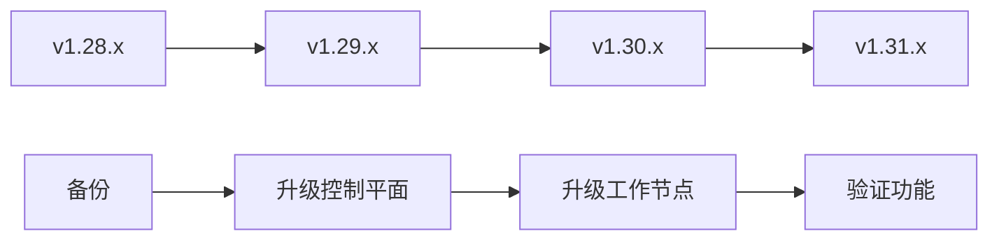

# 📖 扩展阅读指南

本文档提供了深入了解 Kubernetes 高可用部署工具的扩展阅读材料，帮助您更好地理解和使用本项目。

## 📚 核心组件深入理解

### 🔧 容器运行时选择

深入了解不同容器运行时的特点和选择标准：

- [📘 如何选择运行时组件](09/如何选择运行时组件.md)

### 🔍 技术架构深度解析

了解项目的技术架构和设计理念，请参考：

- [📄 Kubernetes高可用部署工具项目技术深度解析文档](../Kubernetes高可用部署工具项目技术深度解析文档.md)

## 🌟 Kubernetes 官方资源

### 📖 官方文档

- [Kubernetes 官方文档](https://kubernetes.io/docs/)
- [kubeadm 安装指南](https://kubernetes.io/docs/setup/production-environment/tools/kubeadm/)
- [Kubernetes 集群管理](https://kubernetes.io/docs/tasks/administer-cluster/)
- [高可用集群配置](https://kubernetes.io/docs/setup/production-environment/tools/kubeadm/high-availability/)

### 🔐 安全最佳实践

- [Kubernetes 安全指南](https://kubernetes.io/docs/concepts/security/)
- [Pod 安全标准](https://kubernetes.io/docs/concepts/security/pod-security-standards/)
- [网络策略](https://kubernetes.io/docs/concepts/services-networking/network-policies/)
- [RBAC 授权](https://kubernetes.io/docs/reference/access-authn-authz/rbac/)

## 🔧 Ansible 自动化

### 📚 Ansible 学习资源

- [Ansible 官方文档](https://docs.ansible.com/)
- [Ansible Playbook 最佳实践](https://docs.ansible.com/ansible/latest/user_guide/playbooks_best_practices.html)
- [Ansible 模块参考](https://docs.ansible.com/ansible/latest/collections/index_module.html)

### 🎯 本项目 Ansible 结构

了解本项目的 Ansible 组织结构和最佳实践：

```
kubeadm-ha/
├── ansible.cfg                 # Ansible 配置文件
├── roles/                      # Ansible 角色目录
│   ├── prepare/               # 环境准备角色
│   ├── etcd/                  # Etcd 部署角色
│   ├── kube-master/           # Master 节点角色
│   ├── kube-worker/           # Worker 节点角色
│   ├── load-balancer/         # 负载均衡角色
│   ├── plugins/               # 插件安装角色
│   └── ...                    # 其他角色
├── example/                   # 配置示例
│   ├── hosts.*.ini           # 主机清单示例
│   └── variables.yaml        # 变量配置示例
└── *.yml                     # Playbook 文件
```

## 🗄️ Etcd 集群管理

### 📖 Etcd 学习资源

- [Etcd 官方文档](https://etcd.io/docs/)
- [Etcd 集群操作](https://etcd.io/docs/latest/op-guide/)
- [Etcd 性能调优](https://etcd.io/docs/latest/tuning/)
- [Etcd 灾难恢复](https://etcd.io/docs/latest/op-guide/recovery/)

### 🔧 Etcd 常用命令

```bash
# 集群健康检查
etcdctl endpoint health

# 成员列表
etcdctl member list

# 数据备份
etcdctl snapshot save backup.db

# 数据恢复
etcdctl snapshot restore backup.db

# 性能测试
etcdctl check perf
```

## 🌐 网络组件深入

### 🔗 CNI 网络插件

#### Calico 网络
- [Calico 官方文档](https://projectcalico.docs.tigera.io/)
- [Calico 网络策略](https://projectcalico.docs.tigera.io/security/)
- [Calico 故障排查](https://projectcalico.docs.tigera.io/maintenance/troubleshoot/)

#### Flannel 网络
- [Flannel 项目地址](https://github.com/flannel-io/flannel)
- [Flannel 配置指南](https://github.com/flannel-io/flannel/blob/master/Documentation/configuration.md)

### ⚖️ 负载均衡组件

#### Nginx 负载均衡
- [Nginx 官方文档](https://nginx.org/en/docs/)
- [Nginx 负载均衡配置](https://nginx.org/en/docs/http/load_balancing.html)

#### HAProxy 负载均衡
- [HAProxy 官方文档](https://www.haproxy.org/download/2.4/doc/configuration.txt)
- [HAProxy 最佳实践](https://www.haproxy.com/documentation/hapee/latest/load-balancing/)

#### Keepalived 高可用
- [Keepalived 官方文档](https://keepalived.readthedocs.io/)
- [VRRP 协议理解](https://tools.ietf.org/html/rfc3768)

## 🔐 证书管理深入

### 📜 TLS 证书理解

- [TLS/SSL 证书基础](https://en.wikipedia.org/wiki/Transport_Layer_Security)
- [X.509 证书标准](https://tools.ietf.org/html/rfc5280)
- [OpenSSL 命令参考](https://www.openssl.org/docs/man1.1.1/man1/)

### 🔧 证书操作命令

```bash
# 查看证书信息
openssl x509 -in certificate.crt -text -noout

# 验证证书链
openssl verify -CAfile ca.crt certificate.crt

# 检查证书有效期
openssl x509 -in certificate.crt -noout -dates

# 生成证书签名请求
openssl req -new -key private.key -out certificate.csr
```

## 🚀 容器运行时对比

### 🐳 Docker vs Containerd

| 特性 | Docker | Containerd |
|:-----|:-------|:-----------|
| **性能** | 较高开销 | 更轻量级 |
| **复杂度** | 功能丰富 | 专注容器 |
| **调用链** | kubelet → dockershim → dockerd → containerd | kubelet → CRI → containerd |
| **镜像管理** | docker images | crictl images |
| **容器管理** | docker ps | crictl ps |
| **调试工具** | docker exec | crictl exec |

### 🔧 容器运行时迁移

从 Docker 切换到 containerd 的详细步骤：

1. **准备阶段**
   - 备份现有容器数据
   - 确认应用兼容性
   - 准备维护时间窗口

2. **执行迁移**
   ```bash
   # 使用项目提供的迁移脚本
   ansible-playbook -i example/hosts.m-master.ip.ini 31-docker-to-containerd.yml
   ```

3. **验证阶段**
   - 检查节点状态
   - 验证 Pod 运行
   - 测试应用功能

## 📊 监控和可观测性

### 📈 Prometheus 监控

- [Prometheus 官方文档](https://prometheus.io/docs/)
- [Kubernetes 监控最佳实践](https://prometheus.io/docs/guides/kubernetes-monitoring/)
- [PromQL 查询语言](https://prometheus.io/docs/prometheus/latest/querying/)

### 📊 Grafana 可视化

- [Grafana 官方文档](https://grafana.com/docs/)
- [Kubernetes 仪表板模板](https://grafana.com/grafana/dashboards?search=kubernetes)

### 🔍 日志管理

- [ELK Stack 部署](https://www.elastic.co/guide/en/elastic-stack/current/index.html)
- [Fluentd 日志收集](https://docs.fluentd.org/)
- [Kubernetes 日志架构](https://kubernetes.io/docs/concepts/cluster-administration/logging/)

## 🛡️ 安全加固指南

### 🔒 集群安全检查

```bash
# 使用 kube-bench 进行 CIS 基准测试
kubectl apply -f https://raw.githubusercontent.com/aquasecurity/kube-bench/main/job.yaml

# 使用 falco 进行运行时安全监控
kubectl apply -f https://raw.githubusercontent.com/falcosecurity/falco/master/examples/k8s_audit_config/falco-k8s-audit.yaml

# 扫描镜像漏洞
trivy image nginx:latest
```

### 🛡️ 网络安全策略

```yaml
# 示例：拒绝所有入站流量的网络策略
apiVersion: networking.k8s.io/v1
kind: NetworkPolicy
metadata:
  name: deny-all-ingress
spec:
  podSelector: {}
  policyTypes:
  - Ingress
```

## 🔧 故障排查工具集

### 🔍 诊断命令合集

```bash
#!/bin/bash
# Kubernetes 集群诊断脚本

echo "🔍 Kubernetes 集群诊断报告"
echo "=========================="

# 集群基本信息
echo "📊 集群版本信息:"
kubectl version --short

echo "📋 节点状态:"
kubectl get nodes -o wide

echo "🏗️ 系统 Pod 状态:"
kubectl get pods -n kube-system

echo "🔗 集群组件状态:"
kubectl get componentstatuses

echo "📊 资源使用情况:"
kubectl top nodes 2>/dev/null || echo "Metrics Server 未安装"

echo "🔍 事件信息:"
kubectl get events --sort-by=.metadata.creationTimestamp | tail -10

# 网络诊断
echo "🌐 网络诊断:"
echo "CNI 插件状态:"
kubectl get pods -n kube-system | grep -E "(calico|flannel|weave)"

echo "🔧 存储信息:"
kubectl get storageclass
kubectl get pv

echo "📝 配置信息:"
kubectl get configmaps -n kube-system

echo "🔐 证书状态:"
kubeadm certs check-expiration 2>/dev/null || echo "无法检查证书状态"
```

### 🛠️ 性能调优

#### Master 节点调优
```yaml
# kube-apiserver 性能参数
--max-requests-inflight=400
--max-mutating-requests-inflight=200
--watch-cache-sizes=node#100,pod#1000

# etcd 性能参数
--quota-backend-bytes=8589934592
--auto-compaction-retention=1h
--snapshot-count=10000
```

#### Worker 节点调优
```yaml
# kubelet 性能参数
--max-pods=110
--pods-per-core=10
--kube-api-qps=50
--kube-api-burst=100
```

## 🌟 社区资源

### 📱 官方社区

- [Kubernetes Slack](https://kubernetes.slack.com/)
- [Kubernetes 论坛](https://discuss.kubernetes.io/)
- [GitHub 项目](https://github.com/kubernetes/kubernetes)

### 📖 学习资源

- [Kubernetes 官方教程](https://kubernetes.io/docs/tutorials/)
- [Kubernetes the Hard Way](https://github.com/kelseyhightower/kubernetes-the-hard-way)
- [CNCF 认证课程](https://www.cncf.io/certification/training/)

### 🎓 认证考试

- [CKA (Certified Kubernetes Administrator)](https://www.cncf.io/certification/cka/)
- [CKAD (Certified Kubernetes Application Developer)](https://www.cncf.io/certification/ckad/)
- [CKS (Certified Kubernetes Security Specialist)](https://www.cncf.io/certification/cks/)

## 🔄 版本升级路径

### 📈 升级策略规划



### 🗓️ 版本支持时间线

- **每季度发布**: Kubernetes 每3个月发布一个新的次版本
- **支持周期**: 最新的3个次版本获得社区支持
- **长期支持**: 建议跟随社区支持的版本

## 📞 获取更多帮助

### 🐛 问题报告

如果您发现问题或需要帮助：

1. 📖 首先查看相关文档
2. 🔍 搜索已知问题
3. 🐛 [提交 Issue](https://github.com/TimeBye/Kubernetes/issues)
4. 💬 参与社区讨论

### 🤝 贡献指南

欢迎为项目贡献：

- 🐛 报告 Bug
- 💡 提出功能建议
- 📝 改进文档
- 🔧 提交代码

### 📧 联系方式

- **项目地址**: [GitHub Repository](https://github.com/TimeBye/Kubernetes)
- **问题反馈**: [Issues](https://github.com/TimeBye/Kubernetes/issues)
- **讨论区**: [Discussions](https://github.com/TimeBye/Kubernetes/discussions)

---

**持续学习**: Kubernetes 生态系统发展迅速，建议定期关注官方文档和社区动态，保持知识的更新。

**实践为主**: 理论学习固然重要，但实际动手操作是掌握 Kubernetes 的最佳方式。

**社区参与**: 积极参与社区讨论，分享经验，互帮互助，是提升技能的有效途径。